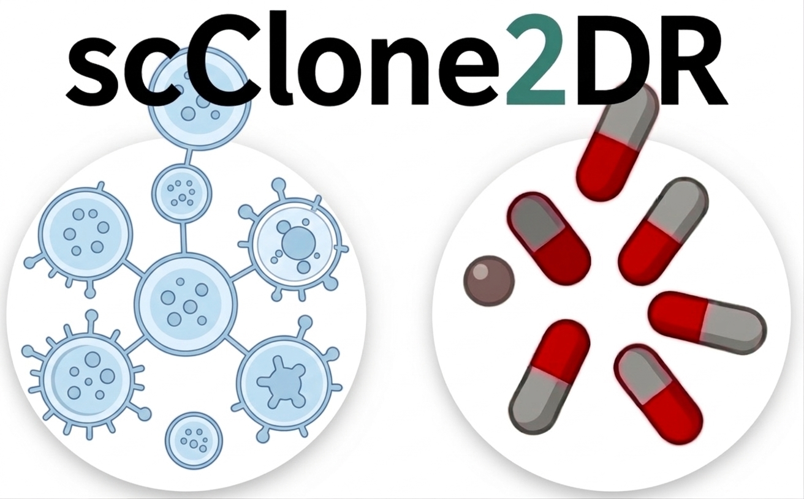

# scClone2DR: Clone-level multi-modal prediction of tumour drug response

<p align="center">
  
</p>

[](https://www.python.org/downloads/)
[](LICENSE)

## Overview

**scClone2DR** is a probabilistic multi-modal framework that predicts drug responses at the level of individual tumour clones by integrating single-cell DNA and RNA sequencing with ex-vivo drug-screening data.

## Features

- **Multi-modal Integration**: Combines scRNA-seq, scDNA-seq and drug-screening data
- **Probabilistic Modeling**: Uses Pyro for Bayesian inference
- **Subclone Analysis**: Models drug response at the clone level
- **Visualization Tools**: Comprehensive result analysis and visualization

## Installation

```bash
git clone https://github.com/cbg-ethz/scClone2DR
cd scClone2DR
pip install -e .
```

## Quick Start

```python
from scclone2dr.data import RealData
from scclone2dr.pipeline import scClone2DRPipeline
from scclone2dr.trainer import Trainer, GuideType

data_source = RealData(
  path_fastdrug="/path/to/FD_data.csv",
  path_rna="/path/to/rna_folder/",
)
data = data_source.get_real_data(concentration_DMSO=5, concentration_drug=5)

pipeline = scClone2DRPipeline(
  data_source=data_source,
  trainer=Trainer(guide_type=GuideType.FULL_MVN),
  mode_nu="noise_correction",
  mode_theta="not shared decoupled",
)

# Configure model topology from data source metadata
pipeline.model.configure(data_source)

params = pipeline.fit(data=data, n_steps=600, penalty_l1=0.1, penalty_l2=0.1)
pipeline.save("checkpoints/real_data_run.npz")
```


## Package Structure

```
scClone2DR/
├── src/
│   └── scclone2dr/
│       ├── data/            # Real/simulated data loaders and dataset utilities
│       ├── baselines/       # FM / NN baseline models
│       ├── inference/       # Posterior sampling and model evaluation
│       ├── plots/           # Visualization helpers
│       ├── model.py         # Core probabilistic model definition
│       ├── trainer.py       # SVI training engine
│       ├── pipeline.py      # End-to-end orchestration API
│       ├── types.py         # Shared typing helpers
│       └── utils.py         # Utility functions
├── notebooks/
├── pyproject.toml
└── setup.py
```

## Main API Modules

- `scclone2dr.data`: data modules (`RealData`, `SimulatedData`, `BaseDataset`)
- `scclone2dr.model`: core generative model (`scClone2DR`)
- `scclone2dr.trainer`: training engine (`Trainer`, `GuideType`)
- `scclone2dr.pipeline`: high-level workflow (`scClone2DRPipeline`)
- `scclone2dr.inference`: posterior sampling and evaluation utilities
- `scclone2dr.plots`: plotting and visualization functions

## Requirements

- Python >= 3.8
- PyTorch >= 1.10.0
- Pyro >= 1.8.0
- NumPy >= 1.20.0
- pandas >= 1.3.0
- h5py >= 3.0.0
- matplotlib >= 3.4.0
- seaborn >= 0.11.0
- tqdm >= 4.60.0
- scikit-learn >= 0.24.0
- scikit-fda>=0.8.1
- nbformat>=5.0.0
- plotly>=5.0.0

## Documentation

For detailed documentation and tutorials, visit:
- [Documentation](https://scClone2DR.readthedocs.io) (coming soon)
- [Tutorial Notebook](notebooks/tutorial_scClone2DR.ipynb)

## Citation

If you use scClone2DR in your research, please cite:

```bibtex
@article{scClone2DR2026,
  title={Clone-level multi-modal prediction of tumour drug response},
  author={Quentin Duchemin , Daniel Trejo Banos, Anne Bertolini, Pedro F. Ferreira, Rudolf Schill,
Matthias Lienhard, Rebekka Wegmann, Tumor Profiler Consortium, Berend Snijder, Daniel Stekhoven,
Niko Beerenwinkel, Franziska Singer, Guillaume Obozinski and Jack Kuipers},
  year={2026}
}
```

## License

This project is licensed under the BSD 3-Clause License - see the [LICENSE](LICENSE) file for details.

## Contact

Quentin Duchemin - qduchemin9@gmail.com

Project Link: [https://github.com/cbg-ethz/scClone2DR](https://github.com/cbg-ethz/scClone2DR)

## Acknowledgments

This project was partially funded by PHRT and SDSC (grant numbers: 2021-802 and C21-19P).
